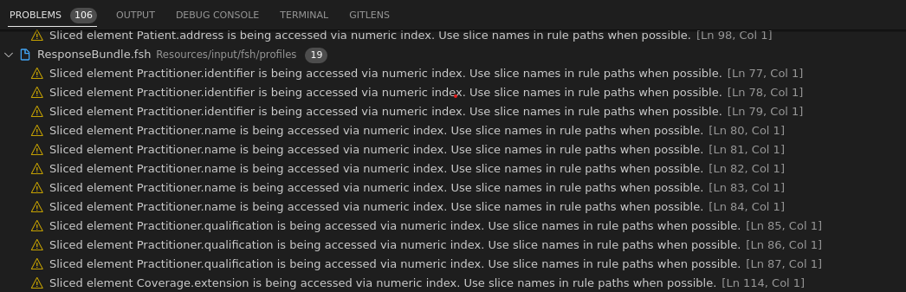
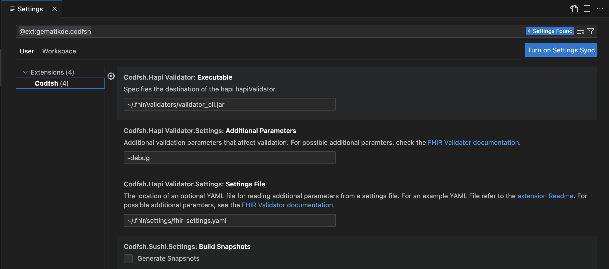

# codfsh extension README

This extensions wrappes SUSHI Shorthand and Hapi Validator to provide propper warning and error messages.

## Features

### Execute Sushi Shorthand

Execute sushi shorthand with `Run Sushi` command to get line based error or warnings messages under the Problems tab in your terminal



> Tip: You can bind a key to execute sushi shorthand. We recommend you use 'F5' to run Sushi.

### Execute Hapi Validator

Execute Hapi Validator with `Run Hapi Validator` command to get line based error or warnings messages under the Problems tab in your terminal

## Requirements

It is mandatory that sushi Shorthand and Hapi Validator are installed on the system.
### Install Sushi Shorthand

```
sudo npm install -g fsh-sushi
```

### Install Hapi Validator

```
sudo dotnet tool install --global firely.terminal
```

The path of the Hapi Validator needs to be specified in the Settings of the extension.
## Extension Settings

To work properly the following settings need to be set:




## Known Issues

* path information in the settings must be absolute. Relative paths do not work at the moment,

## Release Notes


### 1.0.0

Initial release of Extension
